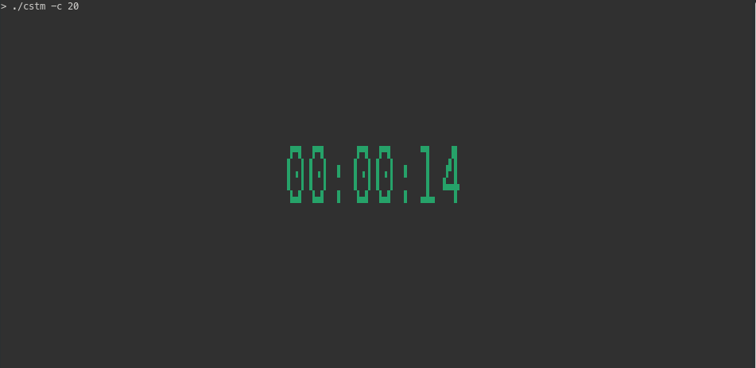
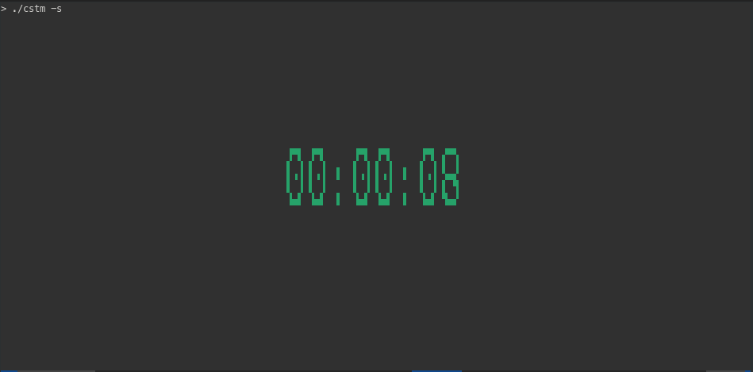

# cstm
A stupidly simple cli tool for time related tasks like stopwatch or countdowns.

---
## Supported operations

### > Countdown

### > Stopwatch

---

## Story
Once, I tried to search for a CLI, distraction-free tool for simple tasks like a stopwatch or countdown. The idea is that TMUX already has a built-in clock (just press `<prefix> + t` and you get it), so I wanted something equally simple. 

I asked an LLM to list some existing tools for me, but instead of giving me a list, it went ahead and generated a whole program. Do not ask me why it did that, I do not know...

I wanted a some apps, so, I searched manually on the web and found a couple of existing implementations there, like:

- [termdown](https://github.com/trehn/termdown)
- [countdown-cli/](https://pypi.org/project/countdown-cli/)
- `ktimer` (Debian)

But honestly, I found them overcomplicated for what I needed (need a python package, rust crate, etc..). What I actually want is just a simple loop and to make it look nice, I can just install `figlet`, which is a go-to package on Unix already.

So, taking the basic idea the LLM gave me, I decided to spend some time to write this really simple program, named `cstm`.